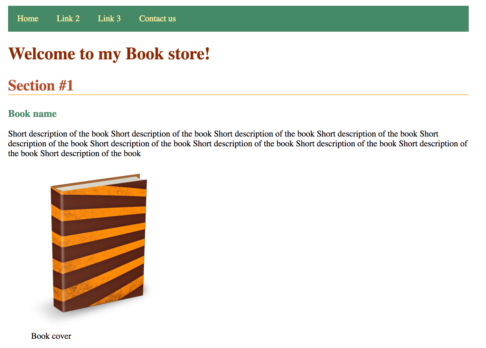
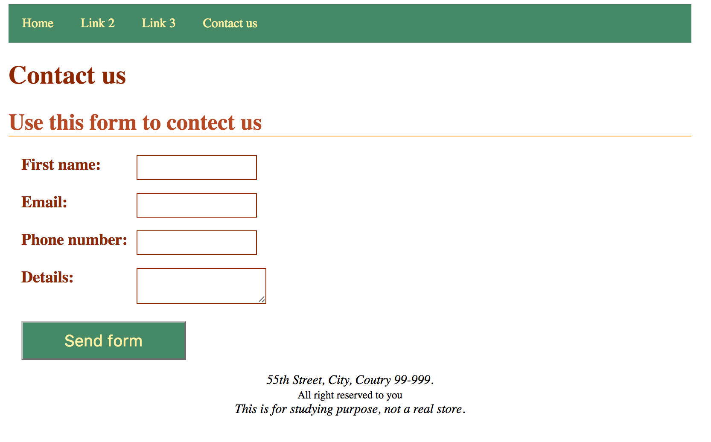

# My Project :)

# Front-End-Beginners---Assignment-2
HTML &amp; Basic CSS exercise

## Project files
The project file is inside the __before__ directory.

files taken from https://github.com/kob-e/Front-End-Beginners---Assignment-1
plus the file:
* images/book-cover.png

## What should you do
### Colors:
the following colors will be used this exercise:
* #1: `rgb(70,137,102)`
* #2: `rgb(255,240,165)`
* #3: `rgb(255,176,59)`
* #4: `rgb(182,73,38)`
* #5: `rgb(142,40,0)`

### HTML
> For images use `figure` and `figcaption` HTML tags please.

#### Open a new HTML file
The file name is `contact.html` with the following fields:
* First name
* Email
* Phone number
* Details
and send button.

### CSS:
#### `index.html`
##### Sizes:
* declare the font size of the document to be 15px;
* declare `h1` font size: `2em`
* declare `h2` font size: `1.75em`
* declare `h3` font size: `1.5em`
* body `width` should be `800px`

##### Colors:
* navigation menu background should be color #1.
* navigation links color should be color #2.
* on navigation link hover: background color #2 and font color #1
* `h1` color #5
* `h2` color #4
* `h3` color #1
* `h1` bottom border color #3

##### Screenshot:

#### `contact.html`
##### Sizes:
* form font size `1.25em`

##### Colors:
* `input`/`textarea` border color #5
* `input`/`textarea` on focus: border color #3
* `button` color #2
* `button` background color #1

##### Screenshot:

### Tips &amp; Tricks
* use `margin: 0 auto` to center page

## Result
Should look like : https://kob-e.github.io/Front-End-Beginners---Assignment-2/after/index.html

### Reference materials

#### Softwares:
Download Brackets: http://brackets.io/
> Brackets github extension name: brackets-git
Git: https://www.atlassian.com/git/tutorials/install-git

#### Videos:
How to use Brackets IDE: https://youtu.be/ZgEkwJKi_Lo

How to install and work with Github &amp; Brackets: https://youtu.be/BSSs1RbwgWg

#### Online tools:
Online code editor: https://plnkr.co/

HTML markup validator: https://validator.w3.org/

CSS validator: https://jigsaw.w3.org/css-validator/

Adobe color wheel: https://color.adobe.com/

Font stack (web safe fonts): http://www.cssfontstack.com/

Font awesome: http://fontawesome.io/icons/
 